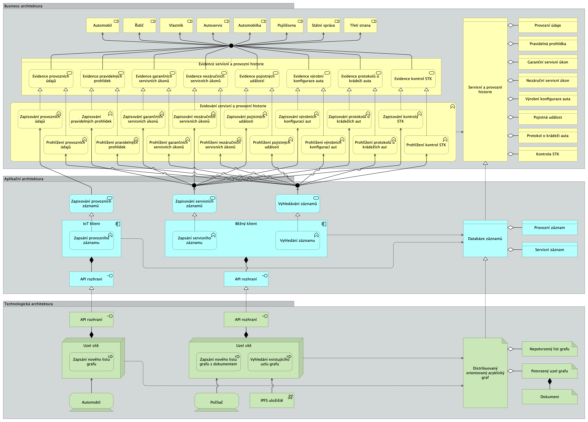

# Servisní a provozní historie

__[Dokumentace architektury](report/html/index.html?view=id-3a55d715047a4ac9b70877037a837cf9 "Dokumentace architektury")__

Model architektury Servisní a provozní historie je praktickou částí diplomové práce Návrh architektury distribuované databáze pro uchování servisní historie automobilu (Martin Friedmann, Vysoká škola ekonomická, 2022).

## [Export](https://github.com/friedmannmartin/servisni_a_provozni_historie/tree/main/export)

Ve složce export jsou k dispozici exportované soubory ve formátech csv a Open Exchange Format (xml), pro účely importu do jiných CASE nástrojů než je Archi.

- [CSV](https://github.com/friedmannmartin/servisni_a_provozni_historie/tree/main/export/csv)
- [Open Exchange Format (xml)](https://github.com/friedmannmartin/servisni_a_provozni_historie/tree/main/export/xml)

## [Report](https://github.com/friedmannmartin/servisni_a_provozni_historie/tree/main/report)

Ve složce report jsou k dispozici soubory dokumetace ve více formátech, tak aby ji bylo možné prohlížet pomocí různých zařízeních a aplikací. Dokumentace je k dispozici ve formátech interaktivního a statického HTML, DOCX, ODT, PDF, PPTX, RTF.

- [HTML](https://github.com/friedmannmartin/servisni_a_provozni_historie/tree/main/report/html)
- [Jasper](https://github.com/friedmannmartin/servisni_a_provozni_historie/tree/main/report/jasper)
